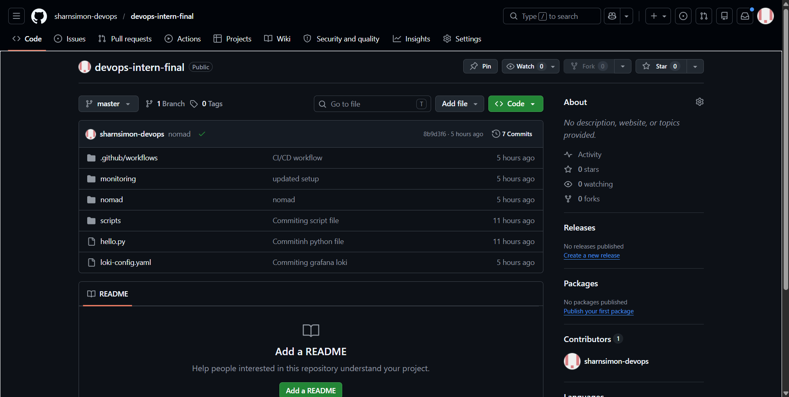
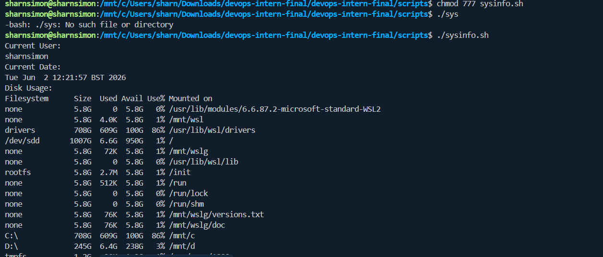
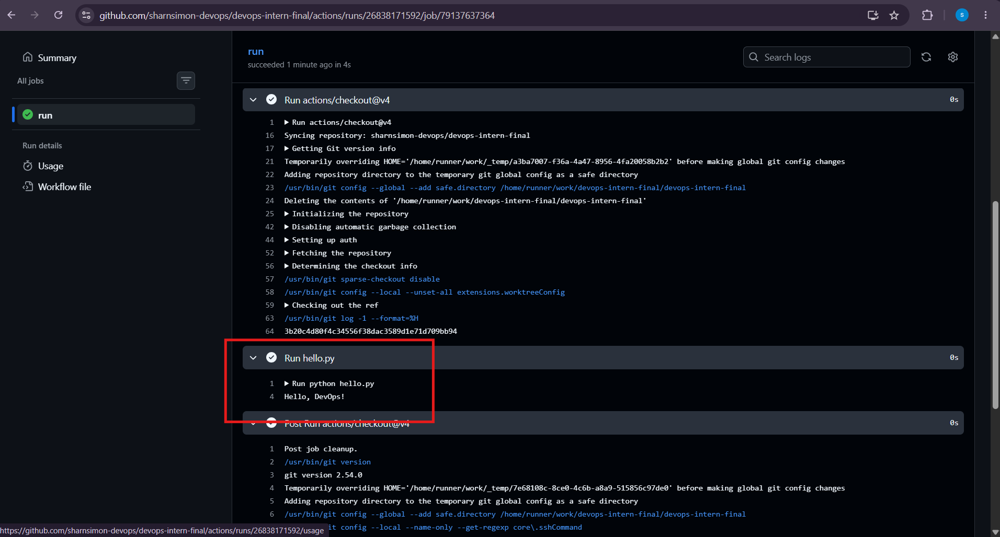
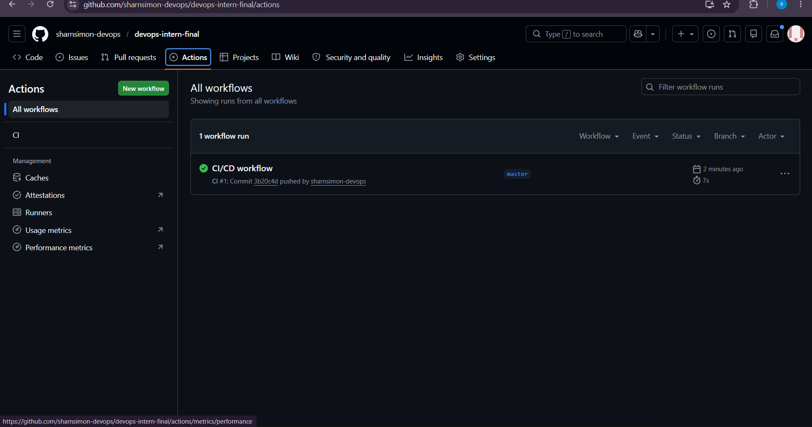
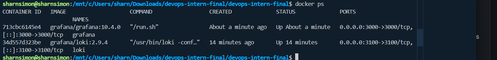

# devops-intern-final

**Name:** Sharn Simon
**Date:** 2026-06-02
**Description:** DevOps Intern Final Assessment — a simple pipeline using Linux, Docker, GitHub Actions, Nomad, and Grafana Loki.


---

## Step 1 — Git & GitHub Setup

Repo created with this README and `hello.py`.

```bash
python hello.py
# Hello, DevOps!
```



---

## Step 2 — Linux Scripting

```bash
chmod +x scripts/sysinfo.sh
./scripts/sysinfo.sh
```



---

## Step 3 — Docker

```bash
docker build -t devops-intern-final .
docker run devops-intern-final
# Hello, DevOps!
```


---

## Step 4 — CI/CD with GitHub Actions

Workflow at `.github/workflows/ci.yml` runs `python hello.py` on every push.





---

## Step 5 — Nomad

```bash
nomad agent -dev
docker build -t devops-intern-final .
nomad job run nomad/hello.nomad
nomad job status hello
```


---

## Step 6 — Monitoring with Grafana Loki

```bash
curl http://localhost:3100/ready
```




See `monitoring/loki_setup.txt` for full setup instructions.