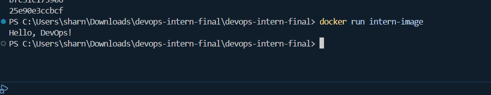
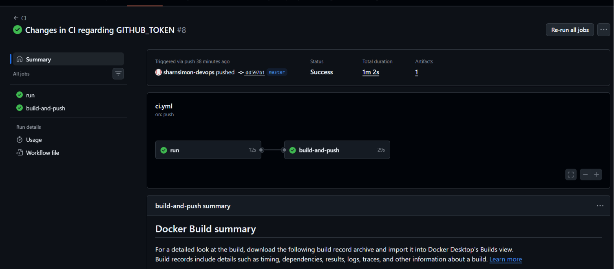
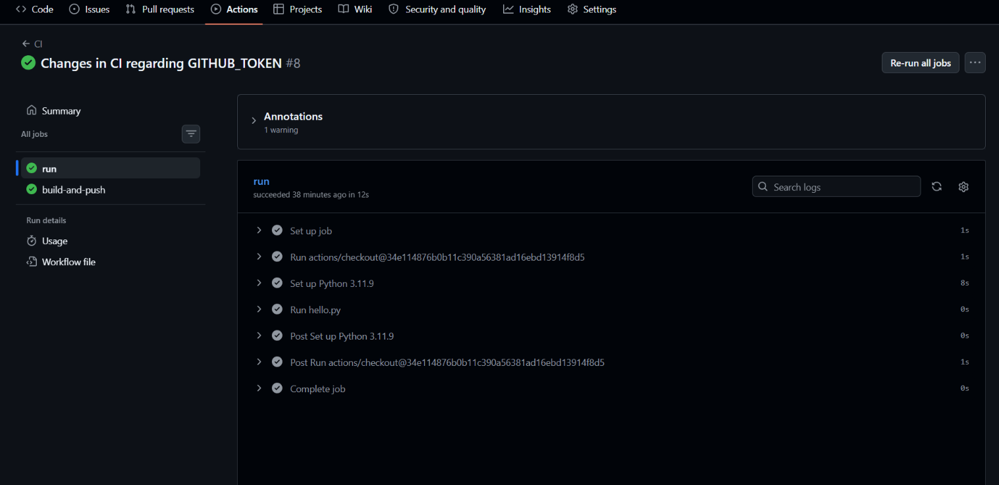
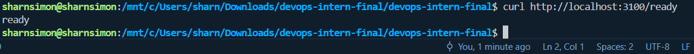
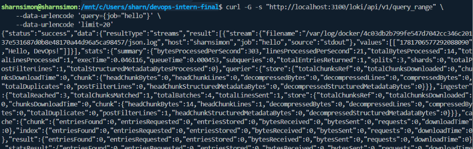
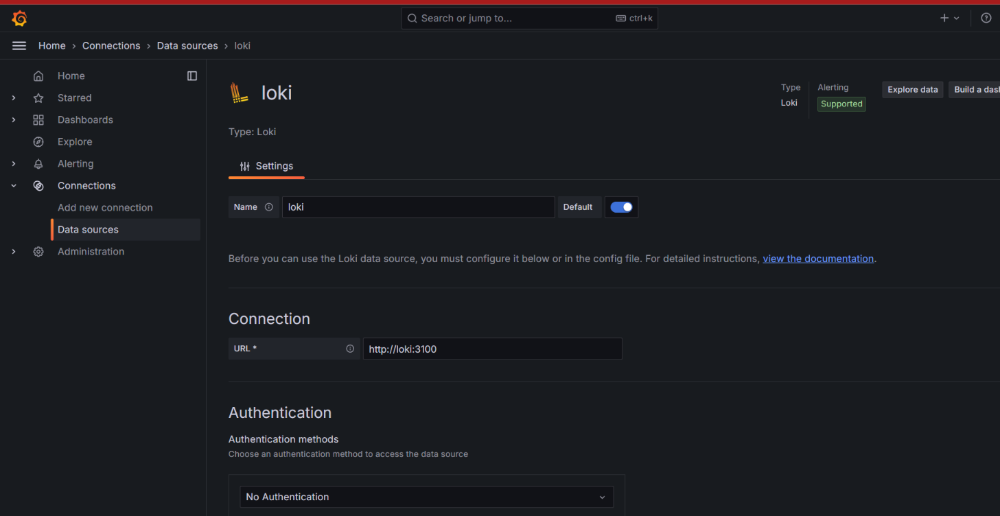
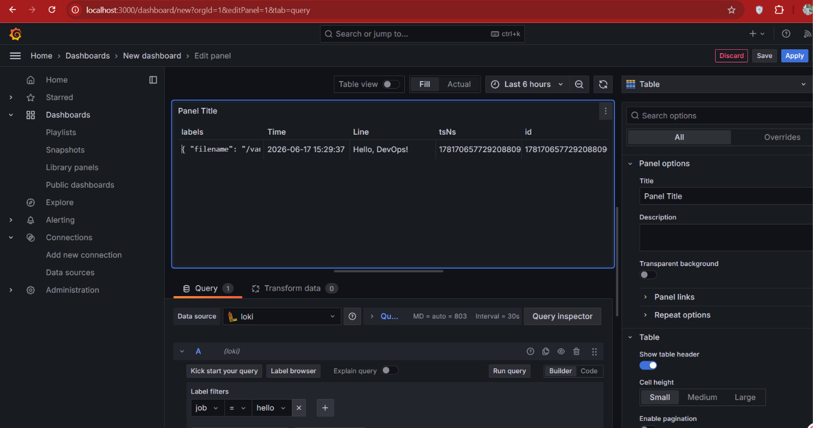

# devops-intern-final

**Name:** Sharn Simon
**Date:** 2026-06-02
**Description:** DevOps Intern Final Assessment — a simple pipeline using Linux, Docker, GitHub Actions, Nomad, and Grafana Loki.


---

## Step 1 — Git & GitHub Setup

Repo created with this README and `hello.py`, which prints `Hello, DevOps!`.

```bash
python hello.py
# Hello, DevOps!
```


---

## Step 2 — Linux & Scripting Basics

`scripts/sysinfo.sh` prints the current user, current date, and disk usage.

```bash
chmod +x scripts/sysinfo.sh
./scripts/sysinfo.sh
```


---

## Step 3 — Docker

The `Dockerfile`:
- uses a pinned base image (`python:3.11.9-slim`, not a floating tag)
- runs as a non-root user (`appuser`)
- has a matching `.dockerignore` to keep the build context clean

```bash
docker build -t devops-intern-final:1.0 .
docker run devops-intern-final:1.0
# Hello, DevOps!
```



---

## Step 4 — CI/CD with GitHub Actions

Workflow at `.github/workflows/ci.yml` runs `python hello.py` automatically on every push.

- `actions/checkout` is pinned to a commit SHA (`34e1148...` = `v4.3.1`), not a floating tag, to prevent supply-chain risk from a tag being repointed.
- CI uses Python `3.11.9` via `actions/setup-python`, matching the exact version pinned in the `Dockerfile`, so a pass in CI reflects the same interpreter that ships in the container.




---

## Step 5 — Job Deployment with Nomad

`nomad/hello.nomad`:
- uses `type = "service"`
- uses a pinned image tag (`devops-intern-final:1.0`, not `:latest`)
- allocates minimal resources (100 MHz CPU, 64 MB memory)
- includes a `logging` block forwarding container logs to Loki
- includes a `restart` policy (3 attempts, 5m interval) so the task is retried on failure rather than left dead
- includes an `update` block (`max_parallel = 1`, rolling) so redeploys don't take the service down all at once

```bash
nomad agent -dev
docker build -t devops-intern-final:1.0 .
nomad job run nomad/hello.nomad
nomad job status hello
```

> Note: Nomad agent could not be started locally due to WSL port restrictions (`listen tcp 127.0.0.1:4647: operation not permitted`). The job file is included as required and was validated for syntax. The commands above will run as-is on a Linux host or VM with Nomad installed.


---

## Step 6 — Monitoring with Grafana Loki

### Start Loki

```bash
docker run -d --name=loki -p 3100:3100 \
  --user root \
  -v $(pwd)/loki-config.yaml:/etc/loki/local-config.yaml \
  grafana/loki:2.9.4 \
  -config.file=/etc/loki/local-config.yaml

curl http://localhost:3100/ready
# ready
```



### Forward container logs to Loki

Logs are forwarded using the Docker `loki` logging driver, not just left idle:

```bash
sudo docker plugin install grafana/loki-docker-driver:2.9.2 --alias loki --grant-all-permissions

docker run --name=hello \
  --log-driver=loki \
  --log-opt loki-url="http://localhost:3100/loki/api/v1/push" \
  --log-opt loki-external-labels="job=hello" \
  devops-intern-final:1.0
```

### View logs

Via Loki's HTTP API directly:

```bash
curl -G -s "http://localhost:3100/loki/api/v1/query_range" \
  --data-urlencode 'query={job="hello"}' \
  --data-urlencode 'limit=20'
```



Confirmed result from this query: `returned_lines=1`, `total_entries=1`, `status=200` — Loki received and is correctly serving back the forwarded log line.

### Optional: Grafana dashboard


```bash
docker run -d --name=grafana -p 3000:3000 grafana/grafana:10.4.0

docker network create loki-net
docker network connect loki-net loki
docker network connect loki-net grafana
```

In Grafana (`http://localhost:3000`, login `admin`/`admin`):
1. **Connections → Data sources → Add data source → Loki**
2. URL: `http://loki:3100` (container name, not `localhost` — Grafana resolves it via the shared `loki-net` network)
3. **Save & test**



4. **Explore → select Loki → run query** `{job="hello"}`



See `monitoring/loki_setup.txt` for the full command-by-command setup log.
